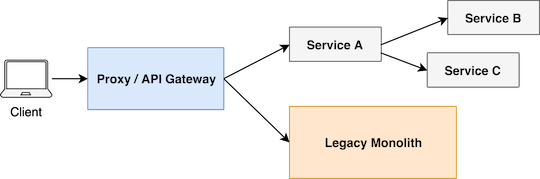

# Xây dựng API Gateway sử dụng Nodejs

Nguồn: [https://blog.risingstack.com/building-an-api-gateway-using-nodejs/](https://blog.risingstack.com/building-an-api-gateway-using-nodejs/)

Các dịch vụ trong một kiến trúc Microservices chia sẻ một vài yêu cầu chung về chứng thực 
và vận chuyển khi chúng cần phải được truy cập bởi người dùng bên ngoài. API Gateway 
cung cấp một **lớp tư duy** để xử lý sự khác biệt giữa dịch vụ giao thức và hoàn thành 
các yêu cầu của khách hàng riêng như trình duyệt máy tính, thiết bị di động và các hệ 
thống kế thừa.

## Microservices và khách hàng

Microservices là một kiến trúc định dướng dịch vụ ở nơi mà các nhóm cần thiết kế, 
phát triển, và vận hành ứng dụng của họ một cách độc lập. Nó cho phép **đa dạng công nghệ** 
trong nhiều cấp độ của hệ thống, ở nơi mà các nhóm có thể hưởng lợi từ sử dụng ngôn ngữ, 
cơ sở dữ liệu, giao thức và lớp vận chuyển tốt nhất cho các thử thách kỹ thuật nhất định. 
Cho ví dụ, một nhóm có thể sử dụng JSON qua HTTP REST trong khi một số nhóm khác có thể 
sử dụng gRPC qua HTTP/2 hoặc một tin nhắn trung gian như RabbitMQ.

Sử dụng tuần tự hóa và phương thức dữ liệu khác nhau có thể ảnh hưởng trong các tình 
huống nhất định, nhưng những **khách hàng** đó muốn sử dụng sản phẩm của chúng tôi có thể 
**có yêu cầu khác nhau**. Vấn đề cũng có thể xảy ra trong các hệ thống có stack công nghệ 
đồng nhất cũng như khách hàng có thể thay đổi từ trình duyệt máy tính cho đến thiết bị 
di động và bàn giao tiếp với các hệ thống kế thừa. Một khách hàng có thể mong đợi định 
dạng XML trong khi một người khác muốn JSON. Trong nhiều trường hợp, bạn cần hỗ trợ cả 2.

Một thách thức khác mà bạn có thể đối mặt khi các khách hàng muốn sử dụng microservices
của bạn đến từ **lớp tư duy** chung như chứng thực, cũng như bạn không muốn thực
hiện lại vài thứ tương tự trong tất cả các dịch vụ của bạn.

Tóm tắt: Chúng ta không muốn thực hiện dịch vụ nội bộ của chúng ta trong kiến trúc 
microservices của chúng ta theo cách hỗ trợ nhiều khách hàng và thực hiện lại 
tư duy tương tự trên tất cả. Đây là nơi mà **API Gateway** đi vào bức ảnh và cung cấp
một **lớp chia sẻ** để xử lý khác nhau giữa dịch vụ giao thức và hoàn thành yêu cầu của 
khách hàng riêng.

## Một API Gatewway là gì?

API Gateway là một loại của dịch vụ trong kiến trúc microservices cũng cấp một lớp chia sẻ 
và API cho khách hàng để kết nối với dịch vụ nội bộ. API Gateway có thể **định tuyến các
yêu cầu**, chuyển đổi các giao thức, tổng hợp dữ liệu và **thực hiện lớp tư duy** như
chứng thực và giới hạn tỷ lệ.

Bạn có thể nghĩ về API Gateway như là điểm vào tới thế giới microservices của chúng tôi. 
Hệ thống của chúng tôi có thể có một hoặc nhiều API Gateways, tùy vào yêu cầu của khách 
hàng. Cho ví dụ, chúng ta có thể có một cổng tách rơi cho trình duyệt máy tính, ứng dụng 
di động và các API công cộng.


*API Gateway as an entry point to microservices*

## Node.js API Gateway cho nhóm frontend 

Khi API Gateway cung cấp chức năng cho các ứng dụng khách hàng như trình duyệt - nó có 
thể được thực hiện và được quản lý bởi nhóm những người chịu trách nhiệm cho ứng dụng 
frontend.

Nó cũng có nghĩa là ngôn ngữ mà API Gateway được thực hiện nên được chọn bởi nhóm có 
trách nhiệm cho khách hàng cụ thể. Vì JavasScript là ngôn ngữ chính để phát triển 
các ứng dụng cho trình duyệt, Node.js có thể là một lựa tuyệt vời để thực hiện một 
API Gateway ngay cả kiến trúc microservices của bạn được phát triển bằng một ngôn ngữ khác.

Netflix sử dụng thành công Node.js API Gateway với java backend của họ để hỗ trợ một 
loạt các khách hàng - để tìm hiểu thêm về cách tiếp cận của họ hãy đọc 
[The "Paved Road" PaaS for Microservices at Netflix] (https://www.infoq.com/news/2017/06/paved-paas-netflix)


*Cách tiếp cận của Netflix để xử lý các khách hàng khác nhau, [nguồn](https://www.slideshare.net/yunongx/paved-paas-to-microservices)*

## Chức năng API Gateway

Chúng tôi đã thảo luận trước đó rằng bạn có thể đặt lớp tư duy chung vào API Gateway 
của bạn, phần này sẽ giới thiệu các trách nhiệm chung phổ biến nhất.

## Định tuyến và phiên bản

Chúng tôi định nghĩa API Gateway như điểm vào cho các dịch vụ microservices của bạn. 
Trong cổng dịch vụ của bạn, bạn có thể **định tuyến các yêu cầu** từ khách hàng đến 
các dịch vụ cụ thể. Bạn cũng có thể **xử lý phiên bản** trong quá trình định tuyến hoặc 
thay đổi giao diện backend trong khi giao diện công khai có thể giữ nguyên. Bạn cũng có 
thể định nghĩa điểm cuối mới trong API Gateway của bạn để hợp tác với nhiều dịch vụ.


*API Gateway như điểm vào microservices*

## Thiết kế tiến hóa
`----------------------------Có vẫn đề ở đây------------------------------`

Cách tiếp cận API Gateway cũng có thể giúp bạn **phá vỡ ứng dụng monolith của bạn**. 
Trong phần lớn các trường hợp viết lại hệ thống của bạn từ đầu như là một microservices 
không phải là ý tưởng tốt và cũng không khả thi như chúng ta cần vận chuyển các tính năng 
cho doanh nghiệp trong quá trình chuyển đổi.

Trong trường hợp này, chúng ta có thể đặt một proxy hoặc một API Gateway ở trước ứng dụng 
monolith của chúng ta và thực hiện **các chức năng mới như microservices** và định tuyến 
điểm cuối mới để các dịch vụ mới trong khi chúng ta có thể sử dụng điểm cuối cũ qua monolith. 
Sau đó chúng ta cũng có thể phá vỡ monolith với chuyển các chức năng hiện có đến các dịch 
vụ mới.

Với thiết kế tiến hóa, chúng ta có thể có một quá trình chuyển đổi trơn tru từ kiến trúc 
monolith đến microservices.



*Thiết kế tiến hóa với API Gateway*

## Xác thực

Hầu hết các cơ sở hạ tầng microservices cần phải thực hiện là xác thực. Đặt **lớp tư duy** 
như xác thực để API Gateway có thể giúp bạn **giữ các dịch vụ nhỏ của bạn** và 
**tập trung vào tên miền**.

Trong một kiến trúc microservices, bạn có thể giữ các dịch vụ của bạn được bảo vệ trong một 
DMZ (khu phi quân sự) qua cấu hình mạng và hiển thị chúng với khách hàng *quan API Gateway*. 
Cổng này cũng có thể xử lý hơn một phương thức xác thực. Cho ví dụ, bạn có thể hỗ trợ 
xác thực dựa trên *cookie* và *token*.


*API Gateway xác thực*

## Tập hợp dữ liệu
`----------------------------Có vẫn đề ở đây------------------------------`

Trong một kiến trúc microservices, nó có thể xảy ra rằng khách hàng cần dữ liệu trong một 
cấp độ tập hợp khác nhau, như các thực thể **dữ liệu denormalizing** diễn ra trong các 
microservices khác nhau. Trong trường hợp này, chúng ta có thể sửa dụng API Gateway của 
chúng ta để **giải quyết** các phụ thuộc và thu thập dữ liệu từ nhiều dịch vụ.

Trong hình dưới đây bạn có thể thấy API Gateway hợp nhất và trả về thông tin người dùng 
và tín dụng như một phần dữ liệu cho khách hàng. Lưu ý, đây là những cái thuộc sở hữu và 
được quản lý bới các microservices khác nhau. 


## Chuyển đổi định dạng chuỗi

Có thể xảy ra rằng chúng tôi cần hỗ trợ khách hàng với yêu cầu định dạng chuỗi dữ liệu khác nhau. 

Hãy tưởng tượng một tính huống mà microservices của chúng ta sử dụng JSON, nhưng một trong những khách hàng của chúng ta sử dụng các API XML. Trong trường hợp này, chúng ta có thể chuyển đổi JSON sang XML vào API Gateway thay vì triển khai nó trong tất cả microservices.


## Chuyển đổi giao thức

Kiến trúc microservices cho phép **giao thoa đa giao thức** để đạt được lợi ích của các công nghệ khác nhau. Tuy nhiên hầu hết khách hàng chỉ hỗ trợ một giao thức. Trong trường hợp này, chúng ta cần phải thay đổi các giao thức dịch vụ cho khách hàng.

Một API Gateway cũng có thể xử lý thay đổi giao thức giữa khách hàng và microservices.

Trong ảnh tiếp theo, bạn có thể thấy làm thế nào để khách hàng mong muốn tất cả các giao thiếp thông qua HTTP REST trong khi bên trong các dịch vụ microservice của chúng ta sử dụng gRPC và GraphQL.


## Giới hạn tốc độ và bộ nhớ đệm

Trong ví dụ trước, bạn có thể thấy rằng chúng ta có thể đặt lớp tư duy như xác thực và API Gateway. Khác với xác thực, bạn có thể thực hiện giới hạn tốc độ, bộ nhớ đệm và các tính năng đáng tin cậy khác trong API Gateway.

`--------------- Có vấn đề -------------------------`
## API Gateway không ngoan

Trong khi triển khai API Gateway, bạn nên tránh đặt logic không chung chung như tên miền chuyển đổi dữ liệu cụ thể tới cổng của bạn.

Các dịch vụ nên luôn luôn có **toàn quyền sở hữu miền dữ liệu** của họ. Xây dựng một 
API Gateway không ngoan **kiểm soát từ các đội dịch vụ** đó là chống lại triết lý 
của microservices.

Điều này là tại sao bạn nên cẩn thận với tập hợp dữ liệu trong API Gateway của bạn - 
nó có thể rất mạnh mẽ nhưng cũng có thể dẫn đến việc chuyển đổi dữ liệu cụ thể hoặc 
quy tắc xử lý mà bạn nên tránh.

Luôn luôn xác định **trách nhiệm rõ ràng** cho cổng API của bạn và chỉ bao gồm lớp tư duy chung trong nó.

## Cổng API của Node.js

Trong khi bạn muốn làm đơn giản hóa mọi thứ trong cổng API của bạn như yêu cầu 
định tuyến tới các dịch vụ cụ thể, bạn có thể **sử dụng một reverse proxy** 
(reverse proxy là một loại proxy server trung gian giữa một máy chủ và các clients gởi tới các yêu cầu.) như nginx. 
Nhưng tại một vài điểm, bạn có thể cần phải thực hiện tư duy đó không được hỗ trợ 
trong các proxy nói chung. Trong trường hợp này, bạn có thể triển khai cổng API cho 
riêng bạn trong Node.js.

Trong Node.js bạn có thể sử dụng gói [http-proxy](https://www.npmjs.com/package/http-proxy) 
để đơn giản yêu cầu proxy đến một dịch vụ cụ thể hoặc bạn có thể sử dụng thêm tính năng 
[express-gateway](http://www.express-gateway.io/) để tạo các cổng API.

Trong ví dụ cổng API đầu tiên của chúng tôi, chúng tôi xác thực yêu cầu trước khi 
chúng tôi ủy quyền cho dịch vụ người dùng.

```javascript
const express = require('express')
const httpProxy = require('express-http-proxy')
const app = express()

const userServiceProxy = httpProxy('https://user-service')

// Authentication
app.use((req, res, next) => {
  // TODO: my authentication logic
  next()
})

// Proxy request
app.get('/users/:userId', (req, res, next) => {
  userServiceProxy(req, res, next)
})
```

Cách tiếp cận khác có thể là khi bạn tạo một yêu cầu mới trong cổng API của bạn, 
và bạn trả lại kết quả cho người dùng:

```javascript
const express = require('express')
const request = require('request-promise-native')
const app = express()

// Resolve: GET /users/me
app.get('/users/me', async (req, res) => {
  const userId = req.session.userId
  const uri = `https://user-service/users/${userId}`
  const user = await request(uri)
  res.json(user)
})
```

## Tóm tắt về cổng API node.js

Cổng API cung cấp một lớp tư duy để phục vụ những yêu cầu khách hàng với kiến trúc 
microservices. Nó giúp giữ những dịch vụ nhỏ của bạn và miền tập trung. Bạn có thể 
đặt tư duy chung khác nhau đến cổng API của bạn, nhưng bạn nên tránh các cổng API 
khổng lồ khi chúng điều khiển từ các nhóm dịch vụ.